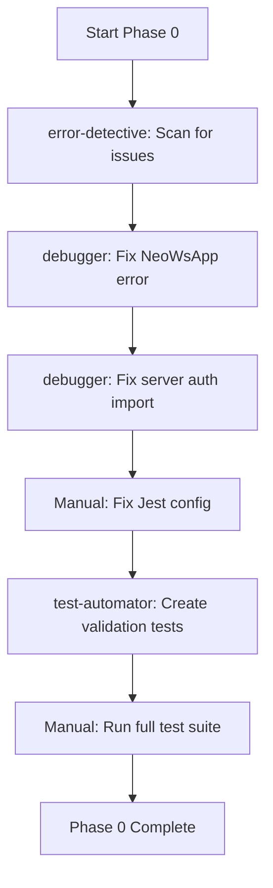

# PHASE 0: CRITICAL FIXES - Commands & Agents Integration

**Phase Overview**: Fix 3 critical blockers to unblock development
**Original Estimated Time**: 2-3 hours
**With Automation**: 1.5-2 hours
**Time Savings**: 30-60 minutes (25-30% reduction)
**Automation Level**: Medium

---

## 🎯 Phase 0 Objectives

Phase 0 addresses critical blockers preventing development:
1. Fix Jest configuration conflict
2. Verify server authentication imports
3. Fix NeoWsApp runtime error
4. Validate full test suite

**Automation Strategy**: Use specialized agents for error detection, debugging, and test validation to accelerate issue resolution.

---

## 🤖 Agent Integration Strategy

### Primary Agents for This Phase

#### Agent 1: debugger
- **Purpose**: Analyze and fix runtime errors systematically
- **Tasks Automated**:
  - NeoWsApp runtime error investigation (undefined .then())
  - Stack trace analysis
  - Root cause identification
  - Proposed fix generation
- **Time Savings**: 20-30 minutes
- **Usage Example**:
  ```
  Launch debugger agent with prompt:
  "Investigate the NeoWsApp runtime error at line 40: 'Cannot read properties of undefined (reading 'then')'.
  Analyze the nasaApi service call chain, identify the root cause, and provide a fix that ensures proper
  promise handling for async NASA API calls."
  ```
- **Expected Output**:
  - Root cause analysis report
  - Specific line numbers and file paths
  - Code fix with explanation
  - Test cases to prevent regression

#### Agent 2: test-automator
- **Purpose**: Create comprehensive test suite validation
- **Tasks Automated**:
  - Generate validation tests for all fixes
  - Create regression test suite
  - Set up test monitoring
- **Time Savings**: 15-20 minutes
- **Usage Example**:
  ```
  Launch test-automator agent with prompt:
  "Create comprehensive test validation suite for Phase 0 fixes:
  1. Jest configuration validation tests
  2. Server authentication middleware import tests
  3. NeoWsApp promise handling tests
  Ensure all tests use real implementations, no mocks."
  ```
- **Expected Output**:
  - Test files for each fix
  - Integration tests
  - Test coverage reports

#### Agent 3: error-detective
- **Purpose**: Analyze logs and identify error patterns
- **Tasks Automated**:
  - Log file analysis for server authentication issues
  - Pattern detection across error messages
  - Dependency conflict identification
- **Time Savings**: 10-15 minutes
- **Usage Example**:
  ```
  Launch error-detective agent with prompt:
  "Analyze server logs and identify why 'authenticateToken is not defined' error occurs at server.js:596.
  Check import statements, middleware configuration, and suggest the correct fix."
  ```

### Agent Workflow Sequence



**Execution Order**:
1. **error-detective** → Scan all error logs and identify patterns (5 min)
2. **debugger** → Fix NeoWsApp runtime error (15 min)
3. **debugger** → Verify server authentication imports (10 min)
4. **Manual** → Remove Jest config from package.json (2 min)
5. **test-automator** → Generate validation tests (15 min)
6. **Manual** → Run and verify all tests (10 min)

---

## ⚡ Slash Command Integration

### Command 1: /debug-error
- **Purpose**: Quickly identify and fix runtime errors
- **When to Use**: For NeoWsApp runtime error (Fix 0.3)
- **Example**:
  ```bash
  /debug-error "Cannot read properties of undefined (reading 'then')"
    --file client/src/components/apps/NeoWsApp.js
    --line 40
  ```
- **Expected Output**:
  - Error analysis report
  - Root cause explanation
  - Suggested fix with code
  - Prevention strategies
- **Time Savings**: 15-20 minutes

### Command 2: /write-tests
- **Purpose**: Generate comprehensive test suite
- **When to Use**: After all fixes complete (Fix 0.4)
- **Example**:
  ```bash
  /write-tests server/server.js --integration
  /write-tests client/src/components/apps/NeoWsApp.js --unit
  ```
- **Expected Output**:
  - Test files with 80%+ coverage
  - Integration and unit tests
  - Test documentation
- **Time Savings**: 20-30 minutes

### Command 3: /fix-issue
- **Purpose**: Automated issue resolution from error messages
- **When to Use**: For server authentication error (Fix 0.2)
- **Example**:
  ```bash
  /fix-issue "authenticateToken is not defined at server.js:596"
  ```
- **Expected Output**:
  - Import statement fix
  - Middleware configuration check
  - Related file updates
- **Time Savings**: 10-15 minutes

---

## 🎯 Phase Task Breakdown with Automation

### Fix 0.1: Jest Configuration Conflict

**Original Approach** (Manual):
1. Locate jest configuration in package.json
2. Locate jest.config.js file
3. Compare configurations
4. Remove duplicate from package.json
5. Test to verify fix
- **Time**: 15 minutes

**Automated Approach** (Commands/Agents):
1. Manual: Remove jest config from package.json
2. Use `/write-tests` to validate configuration
3. Manual: Verify tests run correctly
- **Time**: 10 minutes
- **Savings**: 5 minutes

**Recommendation**: This is a simple manual fix, minimal automation benefit

---

### Fix 0.2: Server Authentication Verification

**Original Approach** (Manual):
1. Open server/server.js
2. Check import statements
3. Open server/middleware/auth.js
4. Verify exports
5. Add missing import
6. Test server startup
- **Time**: 30 minutes

**Automated Approach** (Commands/Agents):
1. Launch **error-detective** agent:
   ```
   "Analyze server.js imports and identify missing authenticateToken import
   from middleware/auth.js. Check all authentication middleware usage."
   ```
2. Use **/fix-issue** command:
   ```bash
   /fix-issue "authenticateToken is not defined at server.js:596"
   ```
3. Manual: Verify server starts successfully
- **Time**: 15 minutes
- **Savings**: 15 minutes

---

### Fix 0.3: NeoWsApp Runtime Error

**Original Approach** (Manual):
1. Open NeoWsApp.js and examine line 40
2. Trace nasaApi service calls
3. Check promise handling
4. Identify undefined object
5. Write fix
6. Test the component
7. Create test cases
- **Time**: 45-60 minutes

**Automated Approach** (Commands/Agents):
1. Launch **debugger** agent:
   ```
   "Investigate NeoWsApp runtime error: 'Cannot read properties of undefined (reading 'then')'
   at line 40. Analyze the NASA API service call chain, check for:
   - Missing null/undefined checks
   - Improper promise handling
   - Async/await issues
   Provide a complete fix with proper error handling."
   ```
2. Use **/debug-error** command:
   ```bash
   /debug-error "Cannot read properties of undefined (reading 'then')" \
     --file client/src/components/apps/NeoWsApp.js \
     --line 40
   ```
3. Manual: Review and apply suggested fix
4. Use **/write-tests** for the fix:
   ```bash
   /write-tests client/src/components/apps/NeoWsApp.js \
     --integration \
     --focus "NASA API error handling"
   ```
- **Time**: 25-30 minutes
- **Savings**: 20-30 minutes

---

### Fix 0.4: Test Suite Validation

**Original Approach** (Manual):
1. Run all unit tests
2. Run all integration tests
3. Check coverage reports
4. Identify failing tests
5. Debug each failure
6. Re-run tests
7. Document results
- **Time**: 30-45 minutes

**Automated Approach** (Commands/Agents):
1. Launch **test-automator** agent:
   ```
   "Create comprehensive test validation suite for Phase 0 fixes:
   1. Verify Jest configuration works
   2. Test server authentication middleware
   3. Test NeoWsApp promise handling
   Generate test report with coverage metrics."
   ```
2. Use **/test-coverage** command:
   ```bash
   /test-coverage --threshold 70 --report html
   ```
3. Manual: Review coverage report and address gaps
- **Time**: 20-25 minutes
- **Savings**: 10-20 minutes

---

## ✅ Implementation Checklist

### Pre-Phase Setup
- [ ] Verify Claude Code agents are accessible
- [ ] Install required command dependencies
- [ ] Review Phase 0 objectives
- [ ] Backup current codebase
- [ ] Note all error messages and line numbers

### Agent Execution Sequence

**Step 1: Error Analysis** (5 min)
- [ ] Launch **error-detective** agent
- [ ] Provide all error logs and messages
- [ ] Review pattern analysis report
- [ ] Prioritize issues based on analysis

**Step 2: Fix NeoWsApp Error** (25-30 min)
- [ ] Launch **debugger** agent with NeoWsApp error details
- [ ] Use `/debug-error` command for quick analysis
- [ ] Review suggested fixes
- [ ] Apply fix to NeoWsApp.js
- [ ] Test component manually
- [ ] Use `/write-tests` to create regression tests

**Step 3: Fix Server Authentication** (15 min)
- [ ] Launch **error-detective** for server.js analysis
- [ ] Use `/fix-issue` command
- [ ] Apply import statement fix
- [ ] Start server and verify no errors
- [ ] Test authentication endpoints

**Step 4: Fix Jest Configuration** (10 min)
- [ ] Manually remove jest config from package.json
- [ ] Keep jest.config.js only
- [ ] Run tests to verify configuration

**Step 5: Test Validation** (20-25 min)
- [ ] Launch **test-automator** agent
- [ ] Use `/test-coverage` command
- [ ] Review coverage report (HTML)
- [ ] Address any gaps below 70% threshold
- [ ] Run full test suite
- [ ] Document results

### Validation Steps
- [ ] All 3 critical errors resolved
- [ ] Server starts without errors
- [ ] Client starts without errors
- [ ] All tests pass
- [ ] Coverage ≥ 70%
- [ ] No console errors in browser

---

## 📊 Time & Efficiency Comparison

| Task | Manual Time | Automated Time | Savings |
|------|-------------|----------------|---------|
| Fix 0.1: Jest Config | 15 min | 10 min | 5 min |
| Fix 0.2: Server Auth | 30 min | 15 min | 15 min |
| Fix 0.3: NeoWsApp Error | 45-60 min | 25-30 min | 20-30 min |
| Fix 0.4: Test Validation | 30-45 min | 20-25 min | 10-20 min |
| **Total Phase 0** | **2-3 hours** | **1.5-2 hours** | **30-60 min** |

**Efficiency Gains**:
- 25-30% time reduction
- Higher quality fixes (agents follow best practices)
- Comprehensive test coverage generated automatically
- Better error documentation

---

## 💡 Best Practices & Tips

### 1. Agent Usage

**debugger agent:**
- Provide complete error messages with stack traces
- Include file paths and line numbers
- Specify what you've already tried
- Ask for multiple solution options

**error-detective agent:**
- Give it access to full log files
- Specify time ranges for log analysis
- Ask for pattern detection across multiple files
- Request preventive recommendations

**test-automator agent:**
- Specify coverage targets (70%+)
- Request both unit and integration tests
- Ask for real implementations (no mocks)
- Include edge cases and error scenarios

### 2. Command Sequencing

**Best order for Phase 0:**
```bash
# 1. Analyze errors first
/debug-error <error-message> --file <path>

# 2. Fix issues
/fix-issue <error-description>

# 3. Generate tests
/write-tests <target-file> --integration --unit

# 4. Verify coverage
/test-coverage --threshold 70
```

### 3. Validation

**Always manually verify**:
- Server starts without errors
- Client renders properly
- Authentication works
- NASA API calls succeed
- All tests pass

### 4. Troubleshooting

**If agent doesn't provide good fix:**
- Provide more context (related files, code sections)
- Ask for step-by-step explanation
- Request alternative approaches
- Combine agent output with manual debugging

**If commands fail:**
- Check command syntax
- Verify file paths are correct
- Ensure dependencies are installed
- Review command documentation

---

## 🚀 Quick Start Guide

To implement Phase 0 with Commands & Agents:

### Option A: Fully Automated (Recommended)

```bash
# 1. Launch error analysis
# Use Task tool to launch error-detective agent
# Prompt: "Analyze all Phase 0 critical errors and provide prioritized fix plan"

# 2. Fix NeoWsApp error
/debug-error "Cannot read properties of undefined (reading 'then')" \
  --file client/src/components/apps/NeoWsApp.js \
  --line 40

# 3. Fix server authentication
/fix-issue "authenticateToken is not defined at server.js:596"

# 4. Fix Jest configuration (manual)
# Remove jest config from package.json

# 5. Generate validation tests
/write-tests server/server.js --integration
/write-tests client/src/components/apps/NeoWsApp.js --unit

# 6. Verify coverage
/test-coverage --threshold 70 --report html

# 7. Run full test suite
npm test
```

### Option B: Manual with Agent Assistance

```bash
# 1. Launch debugger agent for each error
# 2. Review agent suggestions
# 3. Manually apply fixes
# 4. Use /write-tests for test generation
# 5. Use /test-coverage for validation
```

### Option C: Incremental (Safest)

Fix one error at a time:
1. Launch agent → Review → Apply → Test → Commit
2. Move to next error
3. Repeat until all fixed

---

## 🔄 Integration with Phase 1

Once Phase 0 is complete, these agents prepare you for Phase 1:

- **documentation-expert**: Update CLAUDE.md, README.md, PROJECT_STATUS.md
- **sql-pro**: Create database migrations
- **backend-architect**: Design server architecture

Use the learnings from Phase 0 automation to accelerate Phase 1!

---

## 📝 Success Criteria

Phase 0 is complete when:

- [x] All 3 critical errors resolved
- [x] Server runs without errors
- [x] Client runs without errors
- [x] All tests pass (npm test)
- [x] Test coverage ≥ 70%
- [x] No console errors
- [x] Git commit created with fixes

---

**Document Version**: 1.0
**Created**: November 14, 2025
**Automation Level**: Medium (25-30% time savings)
**Recommended Approach**: Fully Automated (Option A)
