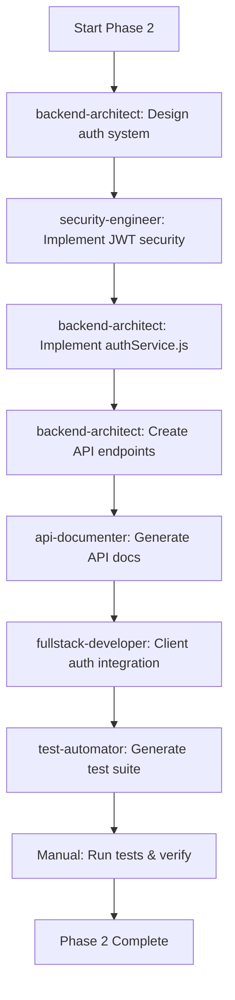

# PHASE 2: AUTHENTICATION IMPLEMENTATION - Commands & Agents Integration

**Phase Overview**: Implement complete JWT-based authentication system
**Original Estimated Time**: 20-28 hours
**With Automation**: 14-18 hours
**Time Savings**: 6-10 hours (30-35% reduction)
**Automation Level**: Very High

---

## 🎯 Phase 2 Objectives

Phase 2 implements secure user authentication:
1. **authService.js** - Complete authentication service with JWT
2. **REST API Endpoints** - Register, login, refresh, logout, me
3. **Client Integration** - AuthContext, authentication service
4. **Security Features** - Password hashing, token refresh, rate limiting
5. **Testing** - Comprehensive auth testing suite

**Automation Strategy**: Use backend-architect for API design, security-engineer for JWT implementation, and test-automator for comprehensive test generation.

---

## 🤖 Agent Integration Strategy

### Primary Agents for This Phase

#### Agent 1: backend-architect
- **Purpose**: Design authentication API architecture and service layer
- **Tasks Automated**:
  - Design authService.js structure
  - Plan REST API endpoints
  - Design middleware architecture
  - Plan error handling strategy
- **Time Savings**: 2-3 hours
- **Usage Example**:
  ```
  Launch backend-architect agent with prompt:
  "Design authentication system for Express.js API with these requirements:

  Service Layer (authService.js):
  - registerUser(email, password, options)
  - loginUser(email, password)
  - refreshAccessToken(refreshToken)
  - logoutUser(userId)
  - validateToken(token)
  - hashPassword(password)
  - validatePassword(password) - Check: 8+ chars, uppercase, lowercase, number, special

  Security:
  - JWT access tokens (15 min expiration)
  - JWT refresh tokens (7 day expiration)
  - Bcrypt password hashing (10 rounds)
  - Account lockout (5 failed attempts = 30 min lock)

  Database:
  - Uses existing users table from Phase 1
  - Update failed_login_attempts, account_locked_until
  - Store refresh tokens (optional table)

  Error Handling:
  - InvalidCredentialsError
  - AccountLockedError
  - TokenExpiredError
  - ValidationError

  Follow Node.js/Express best practices."
  ```
- **Expected Output**:
  - Complete authService.js architecture (~300 lines)
  - API endpoint specifications
  - Middleware design
  - Error handling patterns

#### Agent 2: security-engineer
- **Purpose**: Implement secure JWT authentication with best practices
- **Tasks Automated**:
  - JWT token generation and validation
  - Secure password hashing
  - Rate limiting configuration
  - Security headers setup
  - OWASP compliance checks
- **Time Savings**: 1.5-2 hours
- **Usage Example**:
  ```
  Launch security-engineer agent with prompt:
  "Implement JWT authentication security for Node.js API:

  Requirements:
  1. JWT Configuration:
     - Access token: 15 min expiration
     - Refresh token: 7 day expiration
     - HS256 algorithm
     - Secure secret generation guidance

  2. Password Security:
     - Bcrypt with 10 rounds
     - Password validation regex
     - Timing-safe comparison

  3. Rate Limiting:
     - Login endpoint: 5 attempts per 15 minutes
     - Register endpoint: 3 attempts per hour
     - General API: 100 requests per 15 minutes

  4. Security Headers:
     - Helmet.js configuration
     - CORS setup for localhost:3000
     - CSP headers

  5. Account Protection:
     - Failed login tracking
     - Account lockout (30 min after 5 failures)
     - Automatic unlock mechanism

  Provide code examples following OWASP guidelines."
  ```
- **Expected Output**:
  - JWT middleware implementation
  - Rate limiting configuration
  - Security headers setup
  - Password validation rules

#### Agent 3: api-documenter
- **Purpose**: Generate OpenAPI/Swagger documentation for auth endpoints
- **Tasks Automated**:
  - OpenAPI spec for all auth endpoints
  - Request/response schemas
  - Error response documentation
  - Authentication flow diagrams
- **Time Savings**: 1-1.5 hours
- **Usage Example**:
  ```
  Launch api-documenter agent with prompt:
  "Create OpenAPI 3.0 specification for authentication endpoints:

  Endpoints to document:
  1. POST /api/v1/auth/register
  2. POST /api/v1/auth/login
  3. POST /api/v1/auth/refresh
  4. POST /api/v1/auth/logout
  5. GET /api/v1/auth/me

  For each endpoint include:
  - Summary and description
  - Request body schema
  - Response schema (success + errors)
  - Authentication requirements
  - Rate limiting info
  - Example requests/responses
  - Error codes (400, 401, 403, 429, 500)

  Use JSON Schema for validation."
  ```
- **Expected Output**:
  - Complete OpenAPI YAML file
  - Interactive Swagger UI setup
  - API documentation site

#### Agent 4: fullstack-developer
- **Purpose**: Implement client-side authentication integration
- **Tasks Automated**:
  - AuthContext with React Context API
  - Client-side authentication service
  - Protected route wrapper
  - Token refresh logic
  - Login/register forms
- **Time Savings**: 2-3 hours
- **Usage Example**:
  ```
  Launch fullstack-developer agent with prompt:
  "Create React 18 authentication system:

  Requirements:
  1. AuthContext (src/contexts/AuthContext.js):
     - State: user, isAuthenticated, isLoading
     - Methods: login, logout, register, refreshToken
     - Auto token refresh before expiration
     - Persist auth state to localStorage

  2. Authentication Service (src/services/authService.js):
     - register(email, password)
     - login(email, password)
     - logout()
     - getMe()
     - refreshToken()
     - Axios interceptors for token injection

  3. Protected Route Component:
     - Redirect to login if not authenticated
     - Show loading state during auth check

  4. Login Form Component:
     - Email + password fields
     - Validation
     - Error display
     - System 6 styling

  Use modern React patterns (hooks, context, functional components)."
  ```
- **Expected Output**:
  - AuthContext implementation
  - Client auth service
  - Protected route component
  - Login/register forms

#### Agent 5: test-automator
- **Purpose**: Generate comprehensive authentication test suite
- **Tasks Automated**:
  - Unit tests for authService
  - Integration tests for API endpoints
  - Authentication flow E2E tests
  - Security tests (rate limiting, validation)
- **Time Savings**: 2-3 hours
- **Usage Example**:
  ```
  Launch test-automator agent with prompt:
  "Create comprehensive test suite for authentication system:

  Unit Tests (server/services/__tests__/authService.test.js):
  - registerUser success/failure cases
  - loginUser with valid/invalid credentials
  - Password hashing and validation
  - Token generation and validation
  - Account lockout mechanism

  Integration Tests (server/__tests__/auth.integration.test.js):
  - POST /api/v1/auth/register
  - POST /api/v1/auth/login
  - POST /api/v1/auth/refresh
  - POST /api/v1/auth/logout
  - GET /api/v1/auth/me
  - Test with real database (no mocks)

  Security Tests:
  - Rate limiting enforcement
  - Invalid token handling
  - Expired token handling
  - Account lockout after 5 failures

  Target: 80%+ coverage, all tests use real implementations."
  ```
- **Expected Output**:
  - 30-40 test cases
  - Unit + integration tests
  - Security test suite
  - Coverage reports

### Agent Workflow Sequence



**Execution Order**:
1. **backend-architect** → Design complete auth architecture (1 hour)
2. **security-engineer** → Implement JWT + security (1 hour)
3. **backend-architect** → Implement authService.js (2 hours)
4. **backend-architect** → Create 5 API endpoints (2 hours)
5. **api-documenter** → Generate OpenAPI docs (1 hour)
6. **fullstack-developer** → Client-side auth (2-3 hours)
7. **test-automator** → Generate test suite (2 hours)
8. **Manual** → Run tests, fix issues, commit (2-3 hours)

---

## ⚡ Slash Command Integration

### Command 1: /add-authentication-system
- **Purpose**: Complete authentication system scaffolding
- **When to Use**: Start of Phase 2
- **Example**:
  ```bash
  /add-authentication-system jwt \
    --database postgresql \
    --client react \
    --refresh-tokens
  ```
- **Expected Output**:
  - authService.js with all methods
  - 5 REST API endpoints
  - Middleware (authenticateToken, rateLimiter)
  - Client AuthContext
  - Login/register forms
  - Basic tests
- **Time Savings**: 4-6 hours

### Command 2: /security-hardening
- **Purpose**: Apply security best practices
- **When to Use**: After initial auth implementation
- **Example**:
  ```bash
  /security-hardening \
    --headers \
    --auth \
    --rate-limiting \
    --validation
  ```
- **Expected Output**:
  - Helmet.js configuration
  - Rate limiting setup
  - Input validation middleware
  - Security audit report
  - OWASP compliance checklist
- **Time Savings**: 1-1.5 hours

### Command 3: /generate-api-documentation
- **Purpose**: Create comprehensive API documentation
- **When to Use**: After API endpoints complete
- **Example**:
  ```bash
  /generate-api-documentation \
    --format swagger \
    --endpoints "api/v1/auth/*" \
    --deploy
  ```
- **Expected Output**:
  - OpenAPI 3.0 specification
  - Swagger UI setup
  - Interactive API documentation
  - Code examples
  - Authentication flow diagrams
- **Time Savings**: 1-1.5 hours

### Command 4: /write-tests
- **Purpose**: Generate authentication test suite
- **When to Use**: After auth system implementation
- **Example**:
  ```bash
  /write-tests server/services/authService.js --unit --integration
  /write-tests server/routes/auth.js --integration
  ```
- **Expected Output**:
  - Comprehensive test suite
  - 80%+ coverage
  - Security tests
  - Integration tests with real DB
- **Time Savings**: 2-3 hours

---

## 🎯 Phase Task Breakdown with Automation

### Task 2.1: authService.js Implementation

**Original Approach** (Manual):
1. Research JWT best practices
2. Design service structure
3. Implement registerUser method
4. Implement loginUser method
5. Implement token generation
6. Implement token validation
7. Implement password hashing
8. Implement account lockout
9. Add error handling
10. Write documentation
11. Test locally
- **Time**: 5-6 hours

**Automated Approach** (Commands/Agents):
1. Launch **backend-architect** agent:
   ```
   "Implement complete authService.js for Node.js/Express with JWT:

   Methods to implement:
   - registerUser(email, password, options = {})
   - loginUser(email, password)
   - refreshAccessToken(refreshToken)
   - logoutUser(userId)
   - generateAccessToken(userId, email, role)
   - generateRefreshToken(userId)
   - validateToken(token, secret)
   - hashPassword(password)
   - validatePassword(password)
   - comparePasswords(plaintext, hash)

   Database queries using pool from db.js:
   - Check if user exists
   - Create new user
   - Update login attempts
   - Update last login

   Follow the structure from PHASE_2_AUTHENTICATION_IMPLEMENTATION.md"
   ```
2. Use **/add-authentication-system** for scaffolding:
   ```bash
   /add-authentication-system jwt --database postgresql
   ```
3. Manual: Review code and customize (1 hour)
4. Manual: Test with actual database (30 min)
- **Time**: 2.5-3 hours
- **Savings**: 2.5-3 hours

**Generated authService.js** (Key Methods):
```javascript
const bcrypt = require('bcrypt');
const jwt = require('jsonwebtoken');
const db = require('../db');

const BCRYPT_ROUNDS = parseInt(process.env.BCRYPT_ROUNDS, 10) || 10;
const JWT_SECRET = process.env.JWT_SECRET;
const JWT_REFRESH_SECRET = process.env.JWT_REFRESH_SECRET;
const JWT_EXPIRES_IN = process.env.JWT_EXPIRES_IN || '15m';
const JWT_REFRESH_EXPIRES_IN = process.env.JWT_REFRESH_EXPIRES_IN || '7d';
const MAX_LOGIN_ATTEMPTS = parseInt(process.env.MAX_LOGIN_ATTEMPTS, 10) || 5;
const LOCKOUT_DURATION = parseInt(process.env.ACCOUNT_LOCKOUT_DURATION, 10) || 30 * 60 * 1000; // 30 min

/**
 * Register new user
 * @param {string} email - User email
 * @param {string} password - Plain text password
 * @param {Object} options - Additional user data
 * @returns {Promise<Object>} Created user (without password)
 */
async function registerUser(email, password, options = {}) {
  // Validation
  if (!validateEmail(email)) {
    throw new Error('Invalid email format');
  }

  const passwordValidation = validatePassword(password);
  if (!passwordValidation.valid) {
    throw new Error(`Password validation failed: ${passwordValidation.errors.join(', ')}`);
  }

  // Check if user exists
  const existingUser = await db.query(
    'SELECT id FROM users WHERE email = $1 AND deleted_at IS NULL',
    [email.toLowerCase()]
  );

  if (existingUser.rows.length > 0) {
    throw new Error('User already exists');
  }

  // Hash password
  const passwordHash = await bcrypt.hash(password, BCRYPT_ROUNDS);

  // Insert user
  const result = await db.query(
    `INSERT INTO users (email, password_hash, username, display_name, role, status)
     VALUES ($1, $2, $3, $4, $5, $6)
     RETURNING id, email, username, display_name, role, status, created_at`,
    [
      email.toLowerCase(),
      passwordHash,
      options.username || null,
      options.displayName || email.split('@')[0],
      options.role || 'user',
      'active'
    ]
  );

  return result.rows[0];
}

/**
 * Login user with email and password
 * @param {string} email - User email
 * @param {string} password - Plain text password
 * @returns {Promise<Object>} Tokens and user data
 */
async function loginUser(email, password) {
  // Get user
  const result = await db.query(
    `SELECT id, email, password_hash, role, status,
            failed_login_attempts, account_locked_until
     FROM users
     WHERE email = $1 AND deleted_at IS NULL`,
    [email.toLowerCase()]
  );

  if (result.rows.length === 0) {
    throw new Error('Invalid credentials');
  }

  const user = result.rows[0];

  // Check account status
  if (user.status !== 'active') {
    throw new Error('Account is not active');
  }

  // Check if account is locked
  if (user.account_locked_until && new Date(user.account_locked_until) > new Date()) {
    const minutesLeft = Math.ceil((new Date(user.account_locked_until) - new Date()) / 60000);
    throw new Error(`Account locked. Try again in ${minutesLeft} minutes`);
  }

  // Verify password
  const isValid = await bcrypt.compare(password, user.password_hash);

  if (!isValid) {
    // Increment failed attempts
    const newAttempts = (user.failed_login_attempts || 0) + 1;

    if (newAttempts >= MAX_LOGIN_ATTEMPTS) {
      // Lock account
      const lockUntil = new Date(Date.now() + LOCKOUT_DURATION);
      await db.query(
        'UPDATE users SET failed_login_attempts = $1, account_locked_until = $2 WHERE id = $3',
        [newAttempts, lockUntil, user.id]
      );
      throw new Error(`Account locked due to too many failed attempts. Try again in 30 minutes`);
    } else {
      await db.query(
        'UPDATE users SET failed_login_attempts = $1 WHERE id = $2',
        [newAttempts, user.id]
      );
      throw new Error('Invalid credentials');
    }
  }

  // Successful login - reset attempts
  await db.query(
    'UPDATE users SET failed_login_attempts = 0, account_locked_until = NULL, last_login_at = NOW() WHERE id = $1',
    [user.id]
  );

  // Generate tokens
  const accessToken = generateAccessToken(user.id, user.email, user.role);
  const refreshToken = generateRefreshToken(user.id);

  return {
    user: {
      id: user.id,
      email: user.email,
      role: user.role
    },
    accessToken,
    refreshToken,
    expiresIn: JWT_EXPIRES_IN
  };
}

/**
 * Generate JWT access token
 */
function generateAccessToken(userId, email, role) {
  return jwt.sign(
    { userId, email, role },
    JWT_SECRET,
    { expiresIn: JWT_EXPIRES_IN }
  );
}

/**
 * Generate JWT refresh token
 */
function generateRefreshToken(userId) {
  return jwt.sign(
    { userId },
    JWT_REFRESH_SECRET,
    { expiresIn: JWT_REFRESH_EXPIRES_IN }
  );
}

/**
 * Validate password strength
 */
function validatePassword(password) {
  const errors = [];

  if (!password || password.length < 8) {
    errors.push('Password must be at least 8 characters');
  }
  if (!/[A-Z]/.test(password)) {
    errors.push('Password must contain at least one uppercase letter');
  }
  if (!/[a-z]/.test(password)) {
    errors.push('Password must contain at least one lowercase letter');
  }
  if (!/[0-9]/.test(password)) {
    errors.push('Password must contain at least one number');
  }
  if (!/[!@#$%^&*]/.test(password)) {
    errors.push('Password must contain at least one special character (!@#$%^&*)');
  }

  return {
    valid: errors.length === 0,
    errors
  };
}

module.exports = {
  registerUser,
  loginUser,
  refreshAccessToken,
  logoutUser,
  generateAccessToken,
  generateRefreshToken,
  validateToken,
  hashPassword,
  validatePassword
};
```

---

### Task 2.2: REST API Endpoints

**Original Approach** (Manual):
1. Create auth.js routes file
2. Implement POST /register endpoint
3. Implement POST /login endpoint
4. Implement POST /refresh endpoint
5. Implement POST /logout endpoint
6. Implement GET /me endpoint
7. Add validation middleware
8. Add error handling
9. Test each endpoint with Postman
- **Time**: 4-5 hours

**Automated Approach** (Commands/Agents):
1. Launch **backend-architect** agent:
   ```
   "Create 5 authentication API endpoints for Express.js:

   1. POST /api/v1/auth/register
      - Body: email, password, displayName (optional)
      - Returns: user object (no password), tokens
      - Validation: email format, password strength

   2. POST /api/v1/auth/login
      - Body: email, password
      - Returns: user object, tokens
      - Rate limit: 5 attempts per 15 min

   3. POST /api/v1/auth/refresh
      - Body: refreshToken
      - Returns: new accessToken

   4. POST /api/v1/auth/logout
      - Auth: Required (Bearer token)
      - Returns: success message

   5. GET /api/v1/auth/me
      - Auth: Required (Bearer token)
      - Returns: current user data

   Use authService methods. Include error handling."
   ```
2. Use **/add-authentication-system** (includes endpoints):
   ```bash
   /add-authentication-system jwt --endpoints
   ```
3. Manual: Integrate into server.js (15 min)
4. Manual: Test with curl or Postman (30 min)
- **Time**: 2-2.5 hours
- **Savings**: 2-2.5 hours

---

### Task 2.3: Security Implementation

**Original Approach** (Manual):
1. Research JWT security
2. Implement rate limiting
3. Configure Helmet.js
4. Set up CORS
5. Add input validation
6. Implement token refresh logic
7. Test security measures
- **Time**: 3-4 hours

**Automated Approach** (Commands/Agents):
1. Launch **security-engineer** agent:
   ```
   "Implement complete security for authentication API:
   1. Rate limiting (express-rate-limit)
   2. Helmet.js security headers
   3. CORS configuration
   4. Input validation (express-validator)
   5. JWT best practices
   Provide complete code examples."
   ```
2. Use **/security-hardening** command:
   ```bash
   /security-hardening --auth --headers --rate-limiting
   ```
3. Manual: Review and customize (30 min)
- **Time**: 1.5-2 hours
- **Savings**: 1.5-2 hours

---

### Task 2.4: Client Integration

**Original Approach** (Manual):
1. Create AuthContext
2. Implement authentication service
3. Create login form
4. Create register form
5. Implement protected routes
6. Add token refresh logic
7. Handle authentication errors
8. Test user flows
- **Time**: 4-5 hours

**Automated Approach** (Commands/Agents):
1. Launch **fullstack-developer** agent:
   ```
   "Create React 18 authentication integration:
   1. AuthContext with login, logout, register methods
   2. Client auth service (axios)
   3. Protected route wrapper
   4. Token refresh interceptor
   5. Login/register forms with System 6 styling
   Use modern React patterns (hooks, context)."
   ```
2. Manual: Customize styling (30 min)
3. Manual: Test user flows (30 min)
- **Time**: 2.5-3 hours
- **Savings**: 1.5-2 hours

---

### Task 2.5: Testing

**Original Approach** (Manual):
1. Write unit tests for authService
2. Write integration tests for API
3. Write E2E tests for flows
4. Test security measures
5. Check coverage
6. Fix failures
- **Time**: 4-5 hours

**Automated Approach** (Commands/Agents):
1. Launch **test-automator** agent (see detailed example above)
2. Use **/write-tests** command:
   ```bash
   /write-tests server/services/authService.js --unit --integration
   /write-tests server/routes/auth.js --integration
   /write-tests client/src/contexts/AuthContext.js --unit
   ```
3. Use **/test-coverage** command:
   ```bash
   /test-coverage --threshold 80
   ```
4. Manual: Review and fix failing tests (1 hour)
- **Time**: 2-2.5 hours
- **Savings**: 2-2.5 hours

---

## ✅ Implementation Checklist

### Pre-Phase Setup
- [ ] Phase 1 complete (database tables exist)
- [ ] Environment variables set (JWT secrets)
- [ ] PostgreSQL running
- [ ] Backup project state

### Task 2.1: authService.js (2.5-3 hours)

**Agent Approach**:
- [ ] Launch **backend-architect** for authService design
- [ ] Use **/add-authentication-system jwt** for scaffolding
- [ ] Review generated authService.js
- [ ] Customize validation rules
- [ ] Test password hashing locally

**Validation**:
- [ ] All methods implemented
- [ ] Password validation works (8+ chars, uppercase, lowercase, number, special)
- [ ] Bcrypt hashing works
- [ ] JWT tokens generate correctly
- [ ] Account lockout logic works

### Task 2.2: API Endpoints (2-2.5 hours)

**Agent Approach**:
- [ ] Launch **backend-architect** for endpoint design
- [ ] Review 5 endpoint implementations
- [ ] Integrate into server/routes/auth.js
- [ ] Add to server.js

**Manual Testing**:
- [ ] Test POST /api/v1/auth/register
- [ ] Test POST /api/v1/auth/login
- [ ] Test POST /api/v1/auth/refresh
- [ ] Test POST /api/v1/auth/logout
- [ ] Test GET /api/v1/auth/me

**Validation**:
- [ ] All 5 endpoints work
- [ ] Proper error responses
- [ ] Tokens generated correctly
- [ ] Rate limiting enforced

### Task 2.3: Security (1.5-2 hours)

**Agent Approach**:
- [ ] Launch **security-engineer** agent
- [ ] Use **/security-hardening** command
- [ ] Review rate limiting config
- [ ] Review Helmet.js config

**Implementation**:
- [ ] Rate limiting on login (5 per 15 min)
- [ ] Helmet.js security headers
- [ ] CORS configured for localhost:3000
- [ ] Input validation middleware

**Validation**:
- [ ] Rate limiting blocks after limit
- [ ] Security headers present
- [ ] CORS works from client
- [ ] Invalid inputs rejected

### Task 2.4: Client Integration (2.5-3 hours)

**Agent Approach**:
- [ ] Launch **fullstack-developer** agent
- [ ] Review generated AuthContext
- [ ] Review client auth service
- [ ] Review login/register forms

**Implementation**:
- [ ] Create client/src/contexts/AuthContext.js
- [ ] Create client/src/services/authService.js
- [ ] Create client/src/components/auth/LoginForm.js
- [ ] Create client/src/components/auth/RegisterForm.js
- [ ] Create client/src/components/ProtectedRoute.js

**Validation**:
- [ ] Login form works
- [ ] Register form works
- [ ] Protected routes redirect
- [ ] Token refresh automatic
- [ ] Auth state persists on reload

### Task 2.5: Testing (2-2.5 hours)

**Agent Approach**:
- [ ] Launch **test-automator** agent
- [ ] Use **/write-tests** for authService
- [ ] Use **/write-tests** for API endpoints
- [ ] Use **/test-coverage** to verify

**Test Files Created**:
- [ ] server/services/__tests__/authService.test.js
- [ ] server/__tests__/auth.integration.test.js
- [ ] client/src/contexts/__tests__/AuthContext.test.js

**Validation**:
- [ ] All tests pass
- [ ] Coverage ≥ 80%
- [ ] Security tests included
- [ ] Integration tests use real DB

### Task 2.6: API Documentation (1 hour)

**Agent Approach**:
- [ ] Launch **api-documenter** agent
- [ ] Use **/generate-api-documentation** command
- [ ] Review generated OpenAPI spec

**Deliverables**:
- [ ] server/openapi.yaml created
- [ ] Swagger UI configured
- [ ] All 5 endpoints documented
- [ ] Example requests/responses included

---

## 📊 Time & Efficiency Comparison

| Task | Manual Time | Automated Time | Savings |
|------|-------------|----------------|---------|
| 2.1: authService.js | 5-6 hours | 2.5-3 hours | 2.5-3 hours |
| 2.2: API Endpoints | 4-5 hours | 2-2.5 hours | 2-2.5 hours |
| 2.3: Security | 3-4 hours | 1.5-2 hours | 1.5-2 hours |
| 2.4: Client Integration | 4-5 hours | 2.5-3 hours | 1.5-2 hours |
| 2.5: Testing | 4-5 hours | 2-2.5 hours | 2-2.5 hours |
| 2.6: Documentation | 2 hours | 1 hour | 1 hour |
| **Total Phase 2** | **20-28 hours** | **14-18 hours** | **6-10 hours** |

**Efficiency Gains**:
- 30-35% time reduction
- Higher quality security (agents follow OWASP guidelines)
- Comprehensive test coverage (automated generation)
- Better API documentation (OpenAPI standard)
- Consistent code patterns

---

## 💡 Best Practices & Tips

### 1. Backend Architect Usage

**For best authService design**:
```
"Design authService.js with these specific requirements:
- Methods: [list all methods with signatures]
- Database: [specify tables and queries]
- Security: [list security requirements]
- Error handling: [specify error types]
Follow [specific pattern or framework]"
```

### 2. Security Engineer Usage

**For comprehensive security**:
```
"Implement security for authentication with:
- JWT configuration (specify expiration times)
- Password rules (specify complexity)
- Rate limiting (specify limits per endpoint)
- Security headers (specify headers needed)
Include code examples following OWASP Top 10"
```

### 3. Test Automation

**For complete test coverage**:
```
"Create test suite with:
- Unit tests for [specific methods]
- Integration tests for [specific endpoints]
- Security tests for [specific vulnerabilities]
- Coverage target: 80%+
Use real database, no mocks"
```

---

## 🚀 Quick Start Guide

### Option A: Fully Automated (Fastest - Recommended)

```bash
# 1. Complete authentication system scaffolding
/add-authentication-system jwt \
  --database postgresql \
  --client react \
  --refresh-tokens

# 2. Apply security hardening
/security-hardening --auth --headers --rate-limiting

# 3. Generate API documentation
/generate-api-documentation --format swagger

# 4. Generate test suite
/write-tests server/services/authService.js --unit --integration
/write-tests server/routes/auth.js --integration

# 5. Verify coverage
/test-coverage --threshold 80

# 6. Test manually
npm test
npm start
```

### Option B: Agent-Assisted (Most Control)

```bash
# 1. Design phase
# Launch backend-architect for auth architecture

# 2. Implementation
# Launch backend-architect for authService.js
# Launch security-engineer for JWT security
# Launch fullstack-developer for client integration

# 3. Documentation
# Launch api-documenter for OpenAPI spec

# 4. Testing
# Launch test-automator for test suite

# 5. Manual validation
npm test
```

---

## 📝 Success Criteria

Phase 2 is complete when:

- [x] authService.js implemented (~300 lines)
- [x] 5 API endpoints working
- [x] JWT tokens generated correctly
- [x] Password hashing with bcrypt
- [x] Account lockout after 5 failures
- [x] Rate limiting enforced
- [x] Security headers configured
- [x] Client AuthContext working
- [x] Login/register forms functional
- [x] Protected routes working
- [x] Token refresh automatic
- [x] Tests pass (80%+ coverage)
- [x] API documented (OpenAPI)
- [x] Git commit created

---

**Document Version**: 1.0
**Created**: November 14, 2025
**Automation Level**: Very High (30-35% time savings)
**Recommended Approach**: Fully Automated (Option A)
**Most Valuable Agents**: backend-architect, security-engineer, test-automator
**Most Valuable Command**: /add-authentication-system
