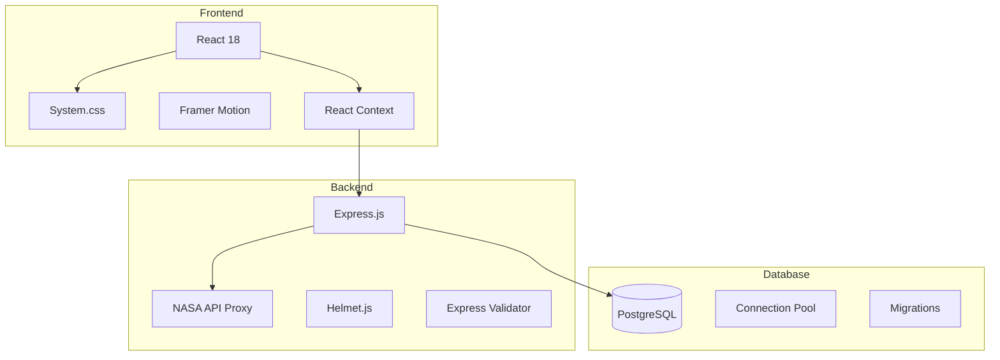

# NASA System 6 Portal - Architecture Documentation

## Overview

This directory contains comprehensive architecture documentation for the NASA System 6 Portal project. The documentation is automatically generated and maintained to ensure it stays current with the codebase.

## Documentation Structure

```
docs/architecture/
├── README.md                           # This file - overview and navigation
├── ARCHITECTURE.md                     # Main architecture documentation
├── adr/                               # Architecture Decision Records
│   ├── README.md                      # ADR index and process
│   ├── 001-react-systemcss.md         # React + System.css framework decision
│   ├── 002-nasa-api-proxy.md          # NASA API proxy architecture
│   ├── 003-postgresql-persistence.md   # PostgreSQL database choice
│   └── ...                            # Additional ADRs
├── generated/                         # Auto-generated documentation
│   ├── components.md                  # Component architecture analysis
│   ├── api.md                         # API endpoint documentation
│   ├── database.md                    # Database schema and design
│   ├── security.md                    # Security analysis and measures
│   └── performance.md                 # Performance metrics and analysis
├── diagrams/                          # Architecture diagrams (Mermaid)
│   ├── system-context.mmd             # System context diagram
│   ├── component-hierarchy.mmd        # Component hierarchy
│   ├── data-flow.mmd                  # Data flow diagram
│   └── deployment.mmd                 # Deployment architecture
└── automation/                        # Documentation generation tools
    ├── documentation-generator.js     # Main documentation generator
    ├── package.json                   # Dependencies for automation
    └── README.md                      # Automation documentation
```

## Quick Navigation

### 📋 Core Documentation
- **[Main Architecture](./ARCHITECTURE.md)** - Complete system architecture overview
- **[Components](./generated/components.md)** - React component analysis and documentation
- **[API](./generated/api.md)** - Backend API endpoints and documentation
- **[Database](./generated/database.md)** - Database schema and design documentation

### 🏛️ Decision Records
- **[ADRs Index](./adr/README.md)** - All architectural decisions and rationale
- **[React Framework Choice](./adr/001-react-systemcss.md)** - Why React + System.css
- **[API Proxy Design](./adr/002-nasa-api-proxy.md)** - Security-first API architecture
- **[Database Selection](./adr/003-postgresql-persistence.md)** - PostgreSQL rationale

### 🔧 Technical Details
- **[Security](./generated/security.md)** - Security measures and vulnerability analysis
- **[Performance](./generated/performance.md)** - Performance metrics and recommendations
- **[Diagrams](./diagrams/)** - Visual architecture representations

## 🚀 Getting Started

### View Documentation

1. **Local Viewing**: Open any `.md` file in your preferred Markdown viewer
2. **Web Server**: Run `cd docs/architecture/automation && npm run docs:serve`
3. **GitHub**: View rendered documentation directly on GitHub

### Generate Documentation

```bash
# Navigate to automation directory
cd docs/architecture/automation

# Install dependencies
npm install

# Generate all documentation
npm run generate

# Validate documentation quality
npm run validate

# Generate diagrams only
npm run diagrams

# Watch for changes and auto-generate
npm run docs:watch
```

### Development Workflow

1. **Code Changes**: Make changes to the codebase
2. **Auto-Generation**: GitHub Actions automatically updates documentation
3. **Review**: Review generated documentation in pull requests
4. **Manual Update**: Run manual generation if needed using the commands above

## 🤖 Automation Features

### Automated Generation

The architecture documentation is automatically generated by:

- **Component Analysis**: Scans React components for props, hooks, and relationships
- **API Documentation**: Analyzes Express.js routes and endpoints
- **Database Schema**: Extracts table definitions and relationships
- **Security Scanning**: Runs vulnerability scans and dependency analysis
- **Performance Metrics**: Analyzes bundle sizes and performance characteristics

### Continuous Updates

- **GitHub Actions**: Automatically runs on code changes
- **Scheduled Updates**: Daily updates for security and performance data
- **Pull Request Integration**: Documentation updated in PR previews
- **Manual Triggers**: Can be triggered manually via GitHub Actions

### Validation

- **Structure Validation**: Ensures all required documentation files exist
- **Content Validation**: Checks documentation completeness and accuracy
- **Link Validation**: Validates internal and external links
- **Format Validation**: Ensures consistent Markdown formatting

## 📊 Architecture Overview

### System Context

The NASA System 6 Portal is a full-stack web application that combines nostalgic Apple System 6 aesthetics with modern web technologies:

- **Frontend**: React 18+ with System.css for authentic retro UI
- **Backend**: Express.js server with NASA API proxy for security
- **Database**: PostgreSQL for data persistence and caching
- **Security**: API key protection, rate limiting, and input validation
- **Performance**: Caching, optimization, and monitoring

### Key Architectural Decisions

1. **React + System.css**: Modern framework with authentic retro styling
2. **API Proxy**: Server-side proxy for NASA API security and performance
3. **PostgreSQL**: Relational database for ACID compliance and JSON support
4. **Component Architecture**: Modular, reusable React components
5. **State Management**: React Context for global state and window management

### Technology Stack



## 🔍 Documentation Maintenance

### Regular Updates

- **Component Documentation**: Updated when React components change
- **API Documentation**: Updated when Express routes change
- **Database Documentation**: Updated when schema changes occur
- **Security Documentation**: Updated with dependency scans
- **Performance Documentation**: Updated with bundle analysis

### Quality Assurance

- **Automated Testing**: Documentation generation is tested
- **Content Review**: Regular review of generated content
- **Accuracy Checks**: Validation against actual codebase
- **Consistency**: Standardized format and structure

### Contributing

When making architectural changes:

1. **Create ADR**: Document the decision with rationale
2. **Update Code**: Implement the architectural change
3. **Generate Docs**: Run documentation generation
4. **Review**: Review updated documentation
5. **Commit**: Include both code and documentation changes

## 📈 Metrics and Monitoring

### Documentation Health

- **Coverage**: Percentage of documented components and APIs
- **Freshness**: How recently documentation was updated
- **Accuracy**: Validation results and error counts
- **Completeness**: Required content presence validation

### Architectural Metrics

- **Component Count**: Number of React components
- **API Endpoints**: Number of API routes and methods
- **Database Tables**: Number of database tables and relationships
- **Dependencies**: Count and analysis of project dependencies
- **Test Coverage**: Documentation coverage vs. code coverage

## 🛠️ Troubleshooting

### Common Issues

**Documentation Generation Fails**
```bash
# Clear node modules and reinstall
cd docs/architecture/automation
rm -rf node_modules package-lock.json
npm install
npm run generate
```

**Missing Components in Documentation**
- Check if components follow React naming conventions
- Ensure components are properly exported
- Verify file paths and naming patterns

**API Documentation Incomplete**
- Check Express route definitions
- Verify route handler functions
- Ensure proper HTTP method annotations

### Getting Help

- **GitHub Issues**: Report documentation generation issues
- **Architecture Review**: Request architectural guidance
- **Documentation PR**: Contribute improvements to documentation

## 📚 Additional Resources

### External Documentation

- **React Documentation**: https://react.dev/
- **System.css**: https://github.com/sachinraja/system.css
- **Express.js**: https://expressjs.com/
- **PostgreSQL**: https://www.postgresql.org/docs/
- **NASA API**: https://api.nasa.gov/

### Related Projects

- **MADR Template**: Architecture Decision Record format
- **C4 Model**: Architecture visualization framework
- **Arc42**: Architecture documentation template
- **Mermaid**: Diagram generation tool

---

## 📞 Support

For questions about the architecture or documentation:

- **GitHub Issues**: Create an issue for architecture questions
- **Pull Requests**: Contribute improvements to architecture
- **Discussions**: Start architecture discussions
- **Code Review**: Request architectural review for changes

---

*This documentation is automatically maintained by the NASA System 6 Portal development team. Last updated: $(date)*