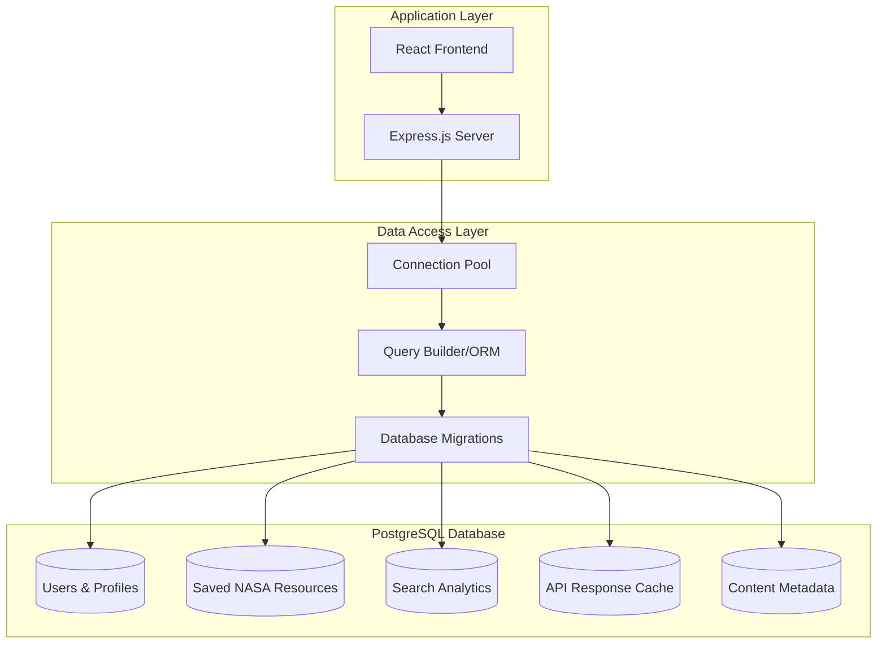

# ADR-003: PostgreSQL for Data Persistence

- **Status**: Accepted
- **Date**: 2024-01-25
- **Decision makers**: Development Team, Database Administrator
- **Superseded by**: None

## Context

The NASA System 6 Portal requires a robust data persistence layer for several critical functions:

### Data Requirements
1. **User Data**: Saved NASA resources, search history, user preferences
2. **Application State**: Window positions, open applications, user settings
3. **Caching Layer**: Cached NASA API responses for performance
4. **Analytics Data**: Usage statistics, popular searches, error tracking
5. **Content Metadata**: Extended metadata for NASA resources

### Technical Requirements
1. **ACID Compliance**: Strong consistency for user data
2. **JSON Support**: Flexible storage for NASA API metadata
3. **Full-Text Search**: Search capabilities across saved content
4. **Relationships**: Foreign key relationships between data entities
5. **Scalability**: Ability to grow with user base and content
6. **Performance**: Fast query responses for common operations

### Operational Requirements
1. **Backup and Recovery**: Regular automated backups
2. **High Availability**: Minimal downtime for maintenance
3. **Security**: Data encryption and access control
4. **Monitoring**: Performance and health monitoring
5. **Migration**: Database schema versioning and migration

### Problem Statement

What database technology should we use to provide reliable, scalable, and performant data persistence for the NASA System 6 Portal?

## Decision

Use PostgreSQL as the primary database for all persistence requirements.

### Architecture Overview


## Options Considered

### Option 1: PostgreSQL (Selected)
**Implementation**: PostgreSQL 14+ with connection pooling and migration management

**Pros**:
- **ACID Compliance**: Strong consistency guarantees
- **JSON Support**: Native JSONB with indexing and querying
- **Full-Text Search**: Built-in FTS capabilities with ranking
- **Performance**: Excellent query performance with proper indexing
- **Scalability**: Proven scalability patterns and tools
- **Ecosystem**: Large ecosystem of tools and extensions
- **Reliability**: Mature, battle-tested database technology
- **Open Source**: No licensing costs, active development

**Cons**:
- **Infrastructure Overhead**: Requires separate database server
- **Scaling Complexity**: Horizontal scaling requires more effort
- **Memory Usage**: Higher memory requirements than alternatives
- **Administration**: Requires database administration skills

### Option 2: MongoDB
**Implementation**: MongoDB with Mongoose ODM

**Pros**:
- **Schema Flexibility**: No rigid schema requirements
- **JSON Native**: Native JSON document storage
- **Scalability**: Easy horizontal scaling
- **Development Speed**: Faster development for simple use cases
- **Cloud Integration**: Excellent managed service offerings

**Cons**:
- **No ACID Guarantees**: Eventual consistency model
- **Query Complexity**: Complex queries can be difficult
- **Transaction Support**: Limited transaction capabilities
- **Data Integrity**: No foreign key constraints
- **Index Limitations**: Limited indexing options compared to relational

### Option 3: SQLite
**Implementation**: SQLite database file with better-sqlite3 driver

**Pros**:
- **Simplicity**: No separate database server required
- **Performance**: Excellent for read-heavy workloads
- **Reliability**: Very stable and well-tested
- **Portability**: Database is just a file
- **Low Overhead**: Minimal resource requirements

**Cons**:
- **Concurrency Limitations**: Limited concurrent write support
- **Network Access**: No network access support
- **Scalability**: Not designed for large-scale applications
- **Feature Limitations**: Limited feature set compared to PostgreSQL

### Option 4: Amazon DynamoDB
**Implementation**: Managed NoSQL database service

**Pros**:
- **Fully Managed**: No database administration required
- **Scalability**: Automatic scaling with performance guarantees
- **Performance**: Predictable single-digit millisecond latency
- **Durability**: Multi-region replication
- **Integration**: Excellent AWS ecosystem integration

**Cons**:
- **Cost**: Can be expensive for high-throughput workloads
- **Learning Curve**: Different query model and concepts
- **Vendor Lock-in**: AWS-specific technology
- **Complex Queries**: Limited query capabilities
- **Data Model**: Requires careful data modeling upfront

## Rationale

PostgreSQL provides the optimal balance of features, performance, and reliability for this project:

1. **Data Integrity**: ACID compliance ensures no data corruption
2. **Flexibility**: JSONB support provides document storage alongside relational data
3. **Performance**: Excellent query performance with proper indexing
4. **Search Capabilities**: Built-in full-text search with ranking and relevance
5. **Reliability**: Mature, battle-tested with excellent community support
6. **Future-Proof**: Advanced features like partitioning and logical replication
7. **Cost-Effective**: Open source with managed service options available

## Consequences

### Positive

1. **Data Integrity**: Strong ACID guarantees prevent data corruption
2. **Query Performance**: Excellent performance with proper indexing
3. **Flexibility**: JSONB support for semi-structured NASA data
4. **Search Capabilities**: Built-in full-text search with ranking
5. **Scalability**: Proven scaling patterns and tools
6. **Reliability**: Mature technology with excellent uptime track record
7. **Community Support**: Large community and extensive documentation
8. **Tooling**: Excellent tooling for administration and development

### Negative

1. **Infrastructure Complexity**: Requires separate database server management
2. **Resource Requirements**: Higher memory and CPU requirements
3. **Administrative Overhead**: Requires database administration skills
4. **Scaling Complexity**: Horizontal scaling requires careful planning
5. **Backup Complexity**: More complex backup and recovery procedures
6. **Initial Setup**: More complex initial setup compared to simpler options

## Implementation

### Database Schema Design

#### Core Tables
```sql
-- Users and Authentication
CREATE TABLE users (
    id UUID PRIMARY KEY DEFAULT gen_random_uuid(),
    username VARCHAR(50) UNIQUE NOT NULL,
    email VARCHAR(255) UNIQUE NOT NULL,
    password_hash VARCHAR(255) NOT NULL,
    preferences JSONB DEFAULT '{}',
    created_at TIMESTAMP WITH TIME ZONE DEFAULT CURRENT_TIMESTAMP,
    updated_at TIMESTAMP WITH TIME ZONE DEFAULT CURRENT_TIMESTAMP
);

-- Saved NASA Resources
CREATE TABLE saved_items (
    id UUID PRIMARY KEY DEFAULT gen_random_uuid(),
    user_id UUID REFERENCES users(id) ON DELETE CASCADE,
    type VARCHAR(20) NOT NULL CHECK (type IN ('apod', 'neo', 'mars', 'epic')),
    title TEXT NOT NULL,
    url TEXT,
    nasa_id TEXT,
    category VARCHAR(50),
    description TEXT,
    metadata JSONB,
    saved_at TIMESTAMP WITH TIME ZONE DEFAULT CURRENT_TIMESTAMP
);

-- Search History and Analytics
CREATE TABLE search_history (
    id UUID PRIMARY KEY DEFAULT gen_random_uuid(),
    user_id UUID REFERENCES users(id) ON DELETE CASCADE,
    query TEXT NOT NULL,
    search_type VARCHAR(20),
    results_count INTEGER,
    search_time TIMESTAMP WITH TIME ZONE DEFAULT CURRENT_TIMESTAMP
);

-- API Response Cache
CREATE TABLE api_cache (
    cache_key TEXT PRIMARY KEY,
    endpoint VARCHAR(100) NOT NULL,
    response_data JSONB NOT NULL,
    expires_at TIMESTAMP WITH TIME ZONE NOT NULL,
    created_at TIMESTAMP WITH TIME ZONE DEFAULT CURRENT_TIMESTAMP
);
```

#### Indexes for Performance
```sql
-- Performance indexes
CREATE INDEX idx_saved_items_user_type ON saved_items(user_id, type);
CREATE INDEX idx_saved_items_saved_at ON saved_items(saved_at DESC);
CREATE INDEX idx_search_history_user_time ON search_history(user_id, search_time DESC);
CREATE INDEX idx_api_cache_expires ON api_cache(expires_at);

-- Full-text search indexes
CREATE INDEX idx_saved_items_search ON saved_items
USING gin(to_tsvector('english', title || ' ' || COALESCE(description, '')));
```

### Technology Stack
```json
{
  "database": "PostgreSQL 14+",
  "driver": "pg (node-postgres) 8.8+",
  "connection_pool": "pg-pool",
  "query_builder": "Knex.js for migrations and queries",
  "orm": "Optional Prisma or TypeORM for complex operations",
  "migrations": "Knex.js migration system",
  "testing": "PostgreSQL test database with fixtures"
}
```

### Connection Management
```javascript
// Database connection configuration
const pool = new Pool({
  host: process.env.DB_HOST,
  port: process.env.DB_PORT,
  database: process.env.DB_DATABASE,
  user: process.env.DB_USER,
  password: process.env.DB_PASSWORD,
  max: 20, // Maximum number of connections
  idleTimeoutMillis: 30000,
  connectionTimeoutMillis: 2000,
});
```

### Migration Strategy
```javascript
// Migration example using Knex.js
exports.up = function(knex) {
  return knex.schema.createTable('saved_items', function(table) {
    table.uuid('id').primary().defaultTo(knex.raw('gen_random_uuid()'));
    table.uuid('user_id').references('id').inTable('users').onDelete('CASCADE');
    table.string('type').notNullable();
    table.string('title').notNullable();
    table.text('url');
    table.jsonb('metadata');
    table.timestamps(true, true);
  });
};
```

### Performance Optimization

#### Query Optimization
1. **Connection Pooling**: Efficient connection reuse
2. **Prepared Statements**: Reuse query plans
3. **Index Strategy**: Proper indexing for common queries
4. **Query Analysis**: Regular EXPLAIN ANALYZE reviews
5. **Materialized Views**: For complex aggregations

#### Caching Strategy
1. **Query Result Caching**: Cache frequently accessed data
2. **Application Caching**: In-memory cache for hot data
3. **Connection Caching**: Keep connections warm
4. **Plan Caching**: Reuse query execution plans

### Backup and Recovery

#### Backup Strategy
```bash
# Automated daily backups
pg_dump -h localhost -U postgres -d nasa_system6 | gzip > backup_$(date +%Y%m%d).sql.gz

# Point-in-time recovery setup
wal_level = replica
archive_mode = on
archive_command = 'cp %p /backup/archive/%f'
```

#### Recovery Procedures
1. **Regular Testing**: Monthly restore testing
2. **Point-in-Time Recovery**: PITR capabilities
3. **Failover Planning**: Replica promotion procedures
4. **Monitoring**: Backup success/failure monitoring

### Monitoring and Observability

#### Key Metrics
1. **Connection Pool**: Active connections, wait times
2. **Query Performance**: Slow query tracking
3. **Resource Usage**: CPU, memory, disk I/O
4. **Database Size**: Table growth rates
5. **Cache Hit Rates**: Buffer cache effectiveness

#### Monitoring Tools
- **pg_stat_statements**: Query performance tracking
- **pg_stat_activity**: Connection monitoring
- **Prometheus Postgres Exporter**: Metrics collection
- **pgBadger**: Log analysis and reporting

## Success Metrics

### Performance Metrics
- Average query response time (< 100ms for common queries)
- Database connection utilization (< 80% average)
- Index effectiveness (> 95% index usage for queries)
- Cache hit rate (> 90% for frequently accessed data)

### Reliability Metrics
- Database uptime (> 99.9%)
- Backup success rate (100%)
- Recovery time objective (< 4 hours)
- Data corruption incidents (zero)

### Operational Metrics
- Migration success rate (100%)
- Monitoring alert effectiveness
- Query optimization improvements
- Storage utilization trends

## Future Considerations

1. **Read Replicas**: Implement read replicas for scaling
2. **Partitioning**: Table partitioning for large datasets
3. **Logical Replication**: Change data capture for real-time features
4. **Advanced Indexing**: BRIN and GIN indexes for specific use cases
5. **Cloud Migration**: Consider managed PostgreSQL services for scaling

---

*This decision establishes PostgreSQL as the foundation for data persistence, ensuring reliability and performance for the NASA System 6 Portal.*