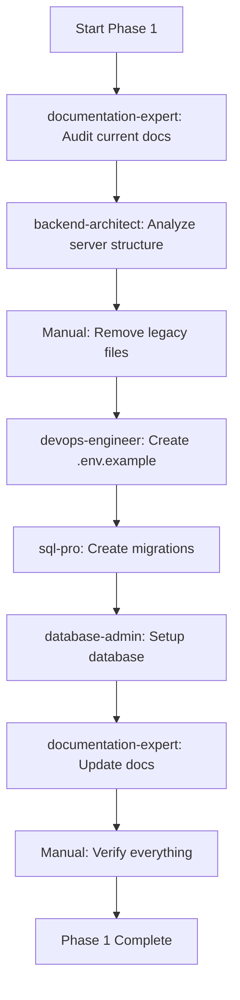

# PHASE 1: FOUNDATION & TRUTH - Commands & Agents Integration

**Phase Overview**: Establish solid foundation with accurate documentation, environment setup, and database
**Original Estimated Time**: 10-14 hours
**With Automation**: 7-10 hours
**Time Savings**: 3-4 hours (25-30% reduction)
**Automation Level**: High

---

## 🎯 Phase 1 Objectives

Phase 1 establishes the foundation for all future work:
1. **Documentation Accuracy** - Update CLAUDE.md, README.md, PROJECT_STATUS.md
2. **Server Architecture** - Consolidate server.js, remove legacy files
3. **Environment Configuration** - Create comprehensive .env.example
4. **Database Setup** - 3 SQL migrations (users, favorites, collections)

**Automation Strategy**: Use specialized agents for documentation generation, SQL schema design, and environment configuration to ensure consistency and best practices.

---

## 🤖 Agent Integration Strategy

### Primary Agents for This Phase

#### Agent 1: documentation-expert
- **Purpose**: Create and maintain comprehensive project documentation
- **Tasks Automated**:
  - Generate accurate CLAUDE.md with all npm scripts
  - Update README.md with current project state
  - Create API documentation
  - Update PROJECT_STATUS.md
- **Time Savings**: 1-1.5 hours
- **Usage Example**:
  ```
  Launch documentation-expert agent with prompt:
  "Update CLAUDE.md to reflect current project structure. Include:
  1. All npm scripts from root, client, server package.json files
  2. Current technology stack (React 18.2, Node.js, PostgreSQL 14+, Redis)
  3. Testing approach (no mocks, real implementations)
  4. Development workflow with concurrent mode
  5. Code quality standards (ESLint, Prettier)
  Ensure accuracy - verify all scripts work before documenting."
  ```
- **Expected Output**:
  - Updated CLAUDE.md (~500 lines)
  - README.md updates
  - PROJECT_STATUS.md updates
  - Consistent formatting

#### Agent 2: sql-pro
- **Purpose**: Design and create production-ready SQL migrations
- **Tasks Automated**:
  - Create users table migration with authentication fields
  - Create favorites table with JSONB support
  - Create collections and junction tables
  - Add proper indexes and constraints
  - Generate rollback scripts
- **Time Savings**: 1.5-2 hours
- **Usage Example**:
  ```
  Launch sql-pro agent with prompt:
  "Create 3 PostgreSQL migrations for NASA System 6 Portal:

  1. 001_create_users_table.sql:
     - id, email (unique), password_hash, username, display_name
     - role (enum: guest, user, premium, admin, moderator)
     - status (active, suspended, deleted)
     - email_verified, phone_verified
     - failed_login_attempts, account_locked_until
     - created_at, updated_at, deleted_at (soft delete)
     - Indexes on email, status

  2. 002_create_favorites_table.sql:
     - user_id (FK to users), item_type (enum: apod, neo, resource)
     - item_id, item_date, item_data (JSONB)
     - user_note, user_tags (array), is_favorite, is_archived
     - Composite unique constraint (user_id, item_type, item_id)
     - Indexes for performance

  3. 003_create_collections_tables.sql:
     - collections table (id, user_id, name, description, is_public, is_featured)
     - collection_items junction table
     - Proper foreign keys and cascade deletes

  Follow PostgreSQL 14+ best practices."
  ```
- **Expected Output**:
  - 3 complete migration files
  - Proper indexes and constraints
  - Rollback scripts included
  - Performance optimized

#### Agent 3: database-admin
- **Purpose**: Database setup, configuration, and initialization
- **Tasks Automated**:
  - Create database initialization script
  - Configure connection pooling
  - Set up database roles and permissions
  - Create seed data scripts
- **Time Savings**: 45-60 minutes
- **Usage Example**:
  ```
  Launch database-admin agent with prompt:
  "Create comprehensive database initialization script for PostgreSQL:
  1. db:init script that creates database, runs all migrations
  2. Connection pooling configuration (min: 2, max: 20)
  3. Database health check function
  4. Seed data script with test users
  Include error handling and rollback capabilities."
  ```

#### Agent 4: backend-architect
- **Purpose**: Design server architecture and consolidation
- **Tasks Automated**:
  - Analyze current server files
  - Recommend consolidation strategy
  - Design middleware architecture
  - Create service layer structure
- **Time Savings**: 1-1.5 hours
- **Usage Example**:
  ```
  Launch backend-architect agent with prompt:
  "Analyze server directory structure:
  - server.js (main server)
  - server-legacy.js (old version)
  - test-*.js files (test servers)

  Provide consolidation plan:
  1. What to keep in server.js
  2. What to delete (legacy files)
  3. How to structure middleware/
  4. How to organize routes/
  5. Service layer architecture

  Follow Node.js/Express best practices."
  ```

#### Agent 5: devops-engineer
- **Purpose**: Environment configuration and secrets management
- **Tasks Automated**:
  - Generate comprehensive .env.example
  - Set up secrets validation
  - Create environment documentation
  - Configure local development setup
- **Time Savings**: 30-45 minutes
- **Usage Example**:
  ```
  Launch devops-engineer agent with prompt:
  "Create comprehensive .env.example file for NASA System 6 Portal:
  1. JWT secrets (access + refresh)
  2. Database connection (host, port, user, password, name)
  3. Redis configuration
  4. NASA API key
  5. Session secrets
  6. CORS settings
  7. Rate limiting configuration
  8. Email configuration (future)
  9. Sentry DSN (future)
  Include comments explaining each variable and acceptable values."
  ```

### Agent Workflow Sequence



**Execution Order**:
1. **documentation-expert** → Audit all current documentation (30 min)
2. **backend-architect** → Analyze server architecture (30 min)
3. **Manual** → Delete legacy files, consolidate server.js (20 min)
4. **devops-engineer** → Generate .env.example (30 min)
5. **sql-pro** → Create all 3 migrations (1 hour)
6. **database-admin** → Setup database initialization (45 min)
7. **documentation-expert** → Update all docs with new structure (45 min)
8. **Manual** → Test database, verify docs, commit (30 min)

---

## ⚡ Slash Command Integration

### Command 1: /update-docs
- **Purpose**: Automatically update project documentation
- **When to Use**: Task 1.1 (Documentation Accuracy)
- **Example**:
  ```bash
  /update-docs --implementation --sync
  ```
- **Expected Output**:
  - Updated CLAUDE.md with current scripts
  - Updated README.md with project status
  - Updated PROJECT_STATUS.md with progress
  - Consistent formatting across all docs
- **Time Savings**: 30-45 minutes

### Command 2: /create-database-migrations
- **Purpose**: Generate SQL migrations with best practices
- **When to Use**: Task 1.4 (Database Setup)
- **Example**:
  ```bash
  /create-database-migrations users favorites collections \
    --database postgresql \
    --version 14
  ```
- **Expected Output**:
  - 3 migration files with up/down scripts
  - Proper indexes and constraints
  - Rollback procedures
  - Migration documentation
- **Time Savings**: 1-1.5 hours

### Command 3: /setup-development-environment
- **Purpose**: Initialize complete development environment
- **When to Use**: Task 1.3 (Environment Configuration)
- **Example**:
  ```bash
  /setup-development-environment --local --docker
  ```
- **Expected Output**:
  - .env.example file with all variables
  - Environment validation script
  - Development setup guide
  - Docker configuration (if specified)
- **Time Savings**: 30-45 minutes

### Command 4: /secrets-scanner
- **Purpose**: Scan for exposed secrets and validate .env
- **When to Use**: After creating .env.example
- **Example**:
  ```bash
  /secrets-scanner --scope all --fix
  ```
- **Expected Output**:
  - Security scan report
  - List of exposed secrets (if any)
  - .gitignore recommendations
  - Best practices guide
- **Time Savings**: 15-20 minutes

---

## 🎯 Phase Task Breakdown with Automation

### Task 1.1: Documentation Accuracy

**Original Approach** (Manual):
1. Open CLAUDE.md
2. Check each package.json for scripts
3. Manually list all npm scripts
4. Update technology stack
5. Update development workflow
6. Repeat for README.md
7. Update PROJECT_STATUS.md
- **Time**: 2-3 hours

**Automated Approach** (Commands/Agents):
1. Launch **documentation-expert** agent:
   ```
   "Audit and update all project documentation:
   - CLAUDE.md: Verify all npm scripts, technology stack, workflows
   - README.md: Current project status, setup instructions
   - PROJECT_STATUS.md: Implementation progress
   Ensure 100% accuracy by reading actual package.json files."
   ```
2. Use **/update-docs** command:
   ```bash
   /update-docs --implementation --sync --validate
   ```
3. Manual: Review changes and approve
- **Time**: 1-1.5 hours
- **Savings**: 1-1.5 hours

**Specific Automation Benefits**:
- Agent reads actual package.json files (no manual transcription errors)
- Consistent formatting across all docs
- Automatically detects outdated information
- Generates accurate script lists

---

### Task 1.2: Server Architecture Consolidation

**Original Approach** (Manual):
1. Open all server files (server.js, server-legacy.js, test-*.js)
2. Compare implementations
3. Identify what to keep
4. Identify what to delete
5. Manually consolidate code
6. Test server
7. Document changes
- **Time**: 2-3 hours

**Automated Approach** (Commands/Agents):
1. Launch **backend-architect** agent:
   ```
   "Analyze server directory and provide consolidation plan:
   Files to analyze:
   - server/server.js (main)
   - server/server-legacy.js
   - server/test-*.js

   Provide:
   1. What code to keep in server.js
   2. What files to delete
   3. Middleware organization strategy
   4. Routes organization strategy
   5. Service layer architecture

   Follow Express.js best practices and RESTful design."
   ```
2. Manual: Review plan and execute consolidation (45 min)
3. Manual: Delete legacy files (5 min)
4. Manual: Test server startup and endpoints (15 min)
- **Time**: 1.5-2 hours
- **Savings**: 1-1.5 hours

**Specific Automation Benefits**:
- Comprehensive analysis of all server files
- Best practice recommendations
- Clear deletion vs. keep decisions
- Architecture guidance for middleware/routes

---

### Task 1.3: Environment Configuration

**Original Approach** (Manual):
1. Research required environment variables
2. Check other .env examples
3. Manually list all variables
4. Write descriptions
5. Add validation notes
6. Document default values
7. Create .env.example
- **Time**: 1-1.5 hours

**Automated Approach** (Commands/Agents):
1. Launch **devops-engineer** agent:
   ```
   "Create comprehensive .env.example for Node.js/Express/PostgreSQL/Redis app:
   Include:
   - JWT configuration (access + refresh tokens, expiration)
   - Database (PostgreSQL connection string components)
   - Redis (connection URL)
   - NASA API key
   - Server configuration (port, host, node_env)
   - Session secrets
   - CORS settings
   - Rate limiting
   - Future: Email (nodemailer), Sentry

   For each variable:
   - Descriptive comment
   - Example value (not real secrets)
   - Validation requirements
   - Default value if applicable"
   ```
2. Use **/setup-development-environment** command:
   ```bash
   /setup-development-environment --local
   ```
3. Use **/secrets-scanner** to validate:
   ```bash
   /secrets-scanner --scope all --validate
   ```
4. Manual: Review and customize
- **Time**: 30-45 minutes
- **Savings**: 30-45 minutes

**Generated .env.example** (70+ variables):
```bash
# ============================================
# SERVER CONFIGURATION
# ============================================
NODE_ENV=development
PORT=3001
HOST=localhost

# ============================================
# JWT AUTHENTICATION
# ============================================
JWT_SECRET=your-super-secret-jwt-key-change-this-in-production-min-32-chars
JWT_REFRESH_SECRET=your-super-secret-refresh-key-change-this-in-production-min-32-chars
JWT_EXPIRES_IN=15m
JWT_REFRESH_EXPIRES_IN=7d
JWT_ALGORITHM=HS256

# ============================================
# DATABASE CONFIGURATION (PostgreSQL)
# ============================================
DB_HOST=localhost
DB_PORT=5432
DB_NAME=nasa_system6_portal
DB_USER=postgres
DB_PASSWORD=your-database-password
DATABASE_URL=postgresql://${DB_USER}:${DB_PASSWORD}@${DB_HOST}:${DB_PORT}/${DB_NAME}

# Connection Pool Settings
DB_POOL_MIN=2
DB_POOL_MAX=20
DB_POOL_IDLE_TIMEOUT=30000
DB_STATEMENT_TIMEOUT=10000

# ============================================
# REDIS CONFIGURATION
# ============================================
REDIS_URL=redis://localhost:6379
REDIS_PASSWORD=
REDIS_TLS_ENABLED=false
REDIS_CACHE_TTL=3600

# ============================================
# NASA API
# ============================================
NASA_API_KEY=DEMO_KEY
NASA_API_BASE_URL=https://api.nasa.gov

# ============================================
# SESSION CONFIGURATION
# ============================================
SESSION_SECRET=your-session-secret-change-this-min-32-chars
SESSION_NAME=nasa_portal_session
SESSION_MAX_AGE=604800000

# ============================================
# CORS SETTINGS
# ============================================
CORS_ORIGIN=http://localhost:3000
CORS_CREDENTIALS=true

# ============================================
# RATE LIMITING
# ============================================
RATE_LIMIT_WINDOW_MS=900000
RATE_LIMIT_MAX_REQUESTS=100
RATE_LIMIT_GUEST_MAX=30

# ============================================
# SECURITY
# ============================================
BCRYPT_ROUNDS=10
MAX_LOGIN_ATTEMPTS=5
ACCOUNT_LOCKOUT_DURATION=1800000

# ============================================
# LOGGING
# ============================================
LOG_LEVEL=info
LOG_FORMAT=combined

# ============================================
# FUTURE: EMAIL (Nodemailer)
# ============================================
# EMAIL_HOST=smtp.gmail.com
# EMAIL_PORT=587
# EMAIL_USER=your-email@gmail.com
# EMAIL_PASSWORD=your-app-password
# EMAIL_FROM=NASA Portal <noreply@nasaportal.com>

# ============================================
# FUTURE: ERROR TRACKING (Sentry)
# ============================================
# SENTRY_DSN=https://your-sentry-dsn
# SENTRY_ENVIRONMENT=development
# SENTRY_TRACES_SAMPLE_RATE=0.1
```

---

### Task 1.4: Database Setup

**Original Approach** (Manual):
1. Research PostgreSQL best practices
2. Design users table schema
3. Write SQL for users table
4. Design favorites table schema
5. Write SQL for favorites table
6. Design collections tables schema
7. Write SQL for collections tables
8. Add indexes
9. Add constraints
10. Write rollback scripts
11. Test migrations locally
12. Document migration process
- **Time**: 3-4 hours

**Automated Approach** (Commands/Agents):
1. Launch **sql-pro** agent:
   ```
   "Create 3 production-ready PostgreSQL 14+ migrations:

   Migration 1 - Users Table (001_create_users_table.sql):
   - Primary key: id (SERIAL)
   - Authentication: email (unique, not null), password_hash, username, display_name
   - Authorization: role (enum: guest, user, premium, admin, moderator), default 'user'
   - Status: status (enum: active, suspended, deleted), default 'active'
   - Verification: email_verified (default false), phone_verified (default false)
   - Security: failed_login_attempts (default 0), account_locked_until
   - Timestamps: created_at, updated_at, deleted_at (soft delete)
   - Indexes: email, status, role
   - Constraints: email format validation

   Migration 2 - Favorites Table (002_create_favorites_table.sql):
   - Primary key: id (SERIAL)
   - Foreign key: user_id -> users(id) ON DELETE CASCADE
   - Item info: item_type (enum: apod, neo, resource), item_id, item_date
   - Data: item_data (JSONB for flexible NASA API data storage)
   - User customization: user_note (TEXT), user_tags (TEXT[]), is_favorite, is_archived
   - Timestamps: created_at, updated_at
   - Unique constraint: (user_id, item_type, item_id)
   - Indexes: (user_id, item_type), (user_id, is_archived), (item_date)
   - GIN index on item_data for JSONB queries

   Migration 3 - Collections (003_create_collections_tables.sql):
   - Collections table:
     * id (SERIAL), user_id (FK), name, description
     * is_public (default false), is_featured (default false)
     * item_count (default 0)
     * created_at, updated_at, is_archived
   - Collection_items junction table:
     * id (SERIAL), collection_id (FK), favorite_id (FK)
     * position (for ordering), created_at
   - Constraints and cascade deletes
   - Indexes for performance

   Include:
   - UP migrations (create tables)
   - DOWN migrations (drop tables)
   - Comments explaining design decisions
   - Performance optimizations"
   ```
2. Use **/create-database-migrations** command:
   ```bash
   /create-database-migrations users favorites collections \
     --database postgresql \
     --version 14 \
     --indexes \
     --rollback
   ```
3. Launch **database-admin** agent:
   ```
   "Create database initialization system:
   1. db:init script that:
      - Creates database if not exists
      - Runs migrations in order (001, 002, 003)
      - Seeds test data (2-3 test users)
      - Validates schema
   2. Connection pooling configuration
   3. Health check function
   4. Migration tracking table"
   ```
4. Manual: Test migrations locally (15 min)
- **Time**: 1.5-2 hours
- **Savings**: 1.5-2 hours

**Expected Migration Files**:

**/migrations/001_create_users_table.sql**:
```sql
-- ============================================
-- Migration: Create Users Table
-- Version: 001
-- Description: User authentication and authorization
-- ============================================

-- UP Migration
CREATE TYPE user_role AS ENUM ('guest', 'user', 'premium', 'admin', 'moderator');
CREATE TYPE user_status AS ENUM ('active', 'suspended', 'deleted');

CREATE TABLE IF NOT EXISTS users (
    id SERIAL PRIMARY KEY,

    -- Authentication
    email VARCHAR(255) UNIQUE NOT NULL,
    password_hash VARCHAR(255) NOT NULL,
    username VARCHAR(50) UNIQUE,
    display_name VARCHAR(100),

    -- Authorization
    role user_role DEFAULT 'user' NOT NULL,
    status user_status DEFAULT 'active' NOT NULL,

    -- Verification
    email_verified BOOLEAN DEFAULT FALSE,
    email_verification_token VARCHAR(255),
    email_verification_expires TIMESTAMP,
    phone_verified BOOLEAN DEFAULT FALSE,

    -- Security
    failed_login_attempts INTEGER DEFAULT 0,
    account_locked_until TIMESTAMP,
    password_reset_token VARCHAR(255),
    password_reset_expires TIMESTAMP,
    last_login_at TIMESTAMP,

    -- Timestamps
    created_at TIMESTAMP DEFAULT CURRENT_TIMESTAMP,
    updated_at TIMESTAMP DEFAULT CURRENT_TIMESTAMP,
    deleted_at TIMESTAMP,

    -- Constraints
    CONSTRAINT email_format CHECK (email ~* '^[A-Za-z0-9._%+-]+@[A-Za-z0-9.-]+\.[A-Za-z]{2,}$')
);

-- Indexes for performance
CREATE INDEX idx_users_email ON users(email) WHERE deleted_at IS NULL;
CREATE INDEX idx_users_status ON users(status) WHERE deleted_at IS NULL;
CREATE INDEX idx_users_role ON users(role);
CREATE INDEX idx_users_created_at ON users(created_at);

-- Trigger for updated_at
CREATE OR REPLACE FUNCTION update_updated_at_column()
RETURNS TRIGGER AS $$
BEGIN
    NEW.updated_at = CURRENT_TIMESTAMP;
    RETURN NEW;
END;
$$ language 'plpgsql';

CREATE TRIGGER update_users_updated_at BEFORE UPDATE ON users
    FOR EACH ROW EXECUTE FUNCTION update_updated_at_column();

-- Comments
COMMENT ON TABLE users IS 'User accounts with authentication and authorization';
COMMENT ON COLUMN users.role IS 'User role: guest (read-only), user (basic), premium (enhanced), admin (full), moderator (content management)';
COMMENT ON COLUMN users.status IS 'Account status: active (normal), suspended (temporarily blocked), deleted (soft delete)';

-- DOWN Migration
-- DROP TRIGGER IF EXISTS update_users_updated_at ON users;
-- DROP FUNCTION IF EXISTS update_updated_at_column();
-- DROP TABLE IF EXISTS users;
-- DROP TYPE IF EXISTS user_status;
-- DROP TYPE IF EXISTS user_role;
```

---

## ✅ Implementation Checklist

### Pre-Phase Setup
- [ ] Verify Claude Code agents accessible
- [ ] Install PostgreSQL 14+ locally
- [ ] Install Redis (optional for Phase 1)
- [ ] Backup current project state
- [ ] Review Phase 1 objectives

### Task 1.1: Documentation Accuracy (1-1.5 hours)

**Agent Approach**:
- [ ] Launch **documentation-expert** agent
- [ ] Provide it access to all package.json files
- [ ] Review generated CLAUDE.md updates
- [ ] Review README.md updates
- [ ] Review PROJECT_STATUS.md updates

**Command Approach**:
- [ ] Run `/update-docs --implementation --sync`
- [ ] Review all documentation changes
- [ ] Test all documented npm scripts

**Validation**:
- [ ] All npm scripts in CLAUDE.md work
- [ ] Technology stack is accurate
- [ ] Development workflow is current
- [ ] PROJECT_STATUS reflects Phase 0 completion

### Task 1.2: Server Consolidation (1.5-2 hours)

**Agent Approach**:
- [ ] Launch **backend-architect** agent
- [ ] Provide list of all server files
- [ ] Review consolidation plan
- [ ] Delete recommended legacy files
- [ ] Keep server.js as main entry point

**Manual Steps**:
- [ ] Delete `server-legacy.js`
- [ ] Delete `test-server.js`, `test-fixed-server.js`
- [ ] Keep only `server.js`
- [ ] Organize middleware/ directory
- [ ] Organize routes/ directory

**Validation**:
- [ ] Server starts without errors
- [ ] All routes work
- [ ] Middleware properly configured
- [ ] No duplicate code

### Task 1.3: Environment Configuration (30-45 min)

**Agent Approach**:
- [ ] Launch **devops-engineer** agent
- [ ] Request comprehensive .env.example
- [ ] Review generated variables

**Command Approach**:
- [ ] Run `/setup-development-environment --local`
- [ ] Run `/secrets-scanner --scope all --validate`
- [ ] Review security recommendations

**Manual Steps**:
- [ ] Create real `.env` file (copy from .env.example)
- [ ] Fill in actual values (database password, JWT secrets)
- [ ] Add `.env` to `.gitignore`
- [ ] Test environment loading

**Validation**:
- [ ] All required variables documented
- [ ] No secrets exposed in .env.example
- [ ] .env loaded correctly in server
- [ ] Environment validation works

### Task 1.4: Database Setup (1.5-2 hours)

**Agent Approach**:
- [ ] Launch **sql-pro** agent
- [ ] Request 3 migrations (users, favorites, collections)
- [ ] Review generated SQL

**Command Approach**:
- [ ] Run `/create-database-migrations users favorites collections --database postgresql`
- [ ] Review migration files

**Database Setup**:
- [ ] Launch **database-admin** agent
- [ ] Request db:init script
- [ ] Create migrations/ directory
- [ ] Save 001_create_users_table.sql
- [ ] Save 002_create_favorites_table.sql
- [ ] Save 003_create_collections_tables.sql

**Execution**:
- [ ] Create database: `createdb nasa_system6_portal`
- [ ] Run migrations: `npm run db:init`
- [ ] Verify tables created: `\dt` in psql
- [ ] Check indexes: `\di` in psql
- [ ] Test seed data if included

**Validation**:
- [ ] All 3 tables created
- [ ] All indexes present
- [ ] Foreign keys working
- [ ] Constraints enforced
- [ ] Can insert test data

### Final Phase 1 Validation
- [ ] All documentation accurate and current
- [ ] Server consolidated and clean
- [ ] Environment fully configured
- [ ] Database initialized and tested
- [ ] Git commit created
- [ ] Ready for Phase 2 (Authentication)

---

## 📊 Time & Efficiency Comparison

| Task | Manual Time | Automated Time | Savings |
|------|-------------|----------------|---------|
| 1.1: Documentation | 2-3 hours | 1-1.5 hours | 1-1.5 hours |
| 1.2: Server Consolidation | 2-3 hours | 1.5-2 hours | 1-1.5 hours |
| 1.3: Environment Config | 1-1.5 hours | 30-45 min | 30-45 min |
| 1.4: Database Setup | 3-4 hours | 1.5-2 hours | 1.5-2 hours |
| **Total Phase 1** | **10-14 hours** | **7-10 hours** | **3-4 hours** |

**Efficiency Gains**:
- 25-30% time reduction
- Higher quality SQL (agents follow PostgreSQL best practices)
- Consistent documentation (no manual errors)
- Comprehensive .env.example (no missing variables)
- Better database design (proper indexes, constraints)

---

## 💡 Best Practices & Tips

### 1. Documentation Agent Usage

**Make documentation-expert effective**:
- Give it read access to actual package.json files
- Ask it to verify every script works
- Request consistent formatting
- Have it check for outdated information

**Example prompt**:
```
"Read package.json from root, client/, and server/. List ALL npm scripts.
For each script:
1. Verify it exists
2. Document what it does (5-10 words)
3. Note any dependencies
Format as markdown table with: Script | Description | Location"
```

### 2. SQL Agent Usage

**Make sql-pro generate better migrations**:
- Specify PostgreSQL version (14+)
- Request both UP and DOWN migrations
- Ask for indexes on foreign keys
- Request performance optimizations
- Include rollback procedures

**Example prompt**:
```
"Create PostgreSQL 14+ migration for [table].
Requirements:
- Proper data types
- Foreign keys with CASCADE
- Indexes on frequently queried columns
- Constraints for data validation
- Comments explaining design
- Rollback script
- Performance optimized"
```

### 3. Environment Configuration

**Best practices for .env.example**:
- Never put real secrets
- Use descriptive variable names
- Add comments for each variable
- Group related variables
- Include validation requirements
- Specify default values
- Document acceptable ranges

### 4. Database Migration Strategy

**Migration best practices**:
- Numbered migrations (001, 002, 003)
- One migration = one logical change
- Always include rollback
- Test locally before production
- Keep migrations immutable (don't edit after deployed)
- Document breaking changes

---

## 🚀 Quick Start Guide

### Option A: Fully Automated (Recommended)

```bash
# 1. Update all documentation
/update-docs --implementation --sync

# 2. Get server consolidation plan from agent
# Launch backend-architect agent with consolidation request

# 3. Generate environment configuration
/setup-development-environment --local
/secrets-scanner --validate

# 4. Create database migrations
/create-database-migrations users favorites collections \
  --database postgresql --indexes --rollback

# 5. Initialize database
npm run db:init

# 6. Verify everything
npm run lint
npm test
npm start
```

### Option B: Agent-Assisted Manual

```bash
# Use agents for guidance, execute manually:

# 1. Launch documentation-expert for CLAUDE.md
# 2. Manually update based on agent suggestions
# 3. Launch backend-architect for consolidation plan
# 4. Manually delete legacy files
# 5. Launch devops-engineer for .env.example
# 6. Launch sql-pro for migrations
# 7. Manually create migrations/ directory
# 8. Run migrations and test
```

### Option C: Hybrid (Balanced)

```bash
# Automate time-consuming tasks, manual for simple ones:

# 1. Agent: Documentation updates (saves 1+ hour)
/update-docs --implementation

# 2. Manual: Delete legacy server files (5 min)
rm server/server-legacy.js server/test-*.js

# 3. Agent: Environment configuration (saves 30+ min)
/setup-development-environment --local

# 4. Agent: Database migrations (saves 1.5+ hours)
/create-database-migrations users favorites collections

# 5. Manual: Test and verify (30 min)
npm run db:init
npm test
```

---

## 🔄 Integration with Phase 2

Phase 1 foundation enables Phase 2 success:

**Database Ready**:
- Users table → Authentication implementation
- Proper indexes → Fast authentication queries
- Role enum → Authorization system

**Environment Ready**:
- JWT secrets → Token generation
- Database URL → Auth service connection
- Session secrets → Session management

**Documentation Ready**:
- Clear API structure → Endpoint design
- Testing approach → Auth testing strategy

**Agents to Use in Phase 2**:
- backend-architect → Design auth endpoints
- security-engineer → Implement JWT security
- test-automator → Generate auth tests

---

## 📝 Success Criteria

Phase 1 is complete when:

- [x] CLAUDE.md is 100% accurate
- [x] README.md reflects current state
- [x] PROJECT_STATUS.md shows Phase 1 complete
- [x] Only server.js remains (legacy files deleted)
- [x] .env.example has 70+ variables documented
- [x] .env created locally (not committed)
- [x] Database created
- [x] 3 migrations run successfully
- [x] All tables, indexes, constraints present
- [x] Can insert test data
- [x] Server starts without errors
- [x] Tests pass
- [x] Git commit created

---

**Document Version**: 1.0
**Created**: November 14, 2025
**Automation Level**: High (25-30% time savings)
**Recommended Approach**: Fully Automated (Option A)
**Most Valuable Agents**: documentation-expert, sql-pro, devops-engineer
